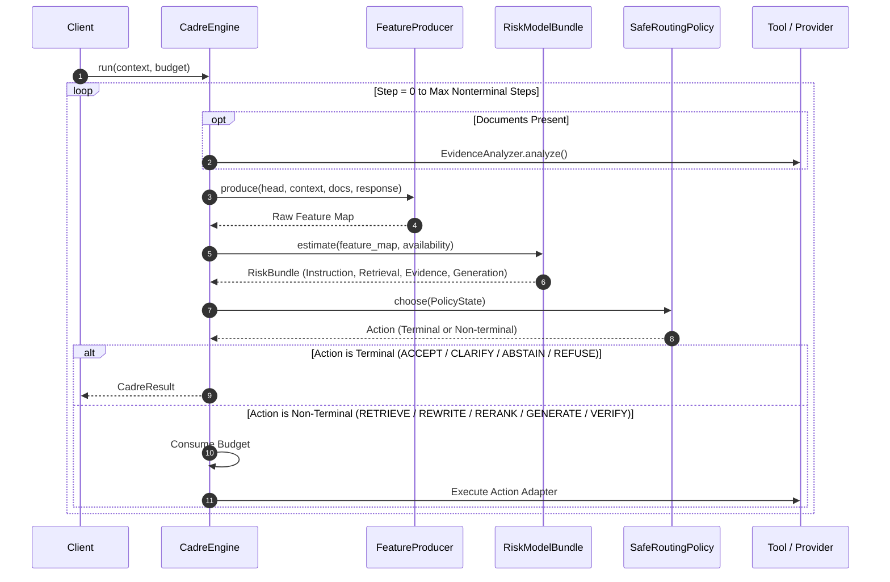

# Architecture

`CadreEngine` coordinates information flow across safety evaluations, retrieval tools, generation providers, and verification steps.

---

## Engine Execution Flow

When `engine.run(context, budget=...)` is invoked, CADRE executes an iterative sense-plan-act loop:

---

## Policy Routing Mechanics

`SafeRoutingPolicy` evaluates the current `PolicyState` against conservative rules to select the next `Action`:

| Condition / Priority | Selected Action | Reason / Policy Logic |
| :--- | :--- | :--- |
| **Instruction Risk Flagged** | `Action.REFUSE` (or `ABSTAIN`) | Prevents execution on prompt injection, role conflicts, or boundary violations. |
| **No Evidence & Retrieval Budget > 0** | `Action.RETRIEVE` | Fetches documents before attempting generation. |
| **No Evidence & Retrieval Budget == 0** | `Action.CLARIFY` (or `ABSTAIN`) | Refuses ungrounded execution when evidence cannot be fetched. |
| **Retrieval Risk Flagged & Retrieval Budget > 0** | `Action.REWRITE` | Rewrites user query to bypass low-quality retrieval or query-evidence mismatch. |
| **Evidence State is `CONTRADICTED` & Retrieval Budget > 0** | `Action.RETRIEVE` | Attempts to fetch alternative documents. |
| **Evidence State is `CONFLICTING` & Verification Budget > 0** | `Action.VERIFY` | Analyzes claim contradictions. |
| **Evidence Risk Flagged & Retrieval Budget > 0** | `Action.RERANK` | Re-orders retrieved evidence. |
| **No Response & Generation Budget > 0** | `Action.GENERATE` | Calls `LLMProvider.generate()`. |
| **Verification State is `CONTRADICTED` & Generation Budget > 0** | `Action.REGENERATE` | Regenerates output to fix contradictions. |
| **Generation Risk Flagged & Verification Budget > 0** | `Action.VERIFY` | Runs `ClaimVerifier.verify()` on response. |
| **Generation Risk Flagged & Generation Budget > 0** | `Action.REGENERATE` | Regenerates output. |
| **Risks Low & Verification `SUPPORTED`/`UNKNOWN` & Response Present** | `Action.ACCEPT` | Returns response to client safely. |

---

## Fail-Closed Mechanism

If an action adapter (e.g., external retriever or LLM provider) raises an unhandled exception:
1. If `strict_provider_failures` is `False` (default), CADRE logs the error, sets failure metadata, and immediately fails closed by returning a `CadreResult` with `status=DecisionStatus.ABSTAINED` and `action=Action.ABSTAIN`.
2. If `strict_provider_failures` is `True`, CADRE re-raises the failure as a `ProviderError`.
