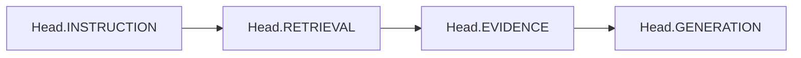

# Components

This page documents CADRE's foundational enums, risk evaluation heads, and result structures.

---

## The Four Risk Heads

CADRE decomposes security and quality evaluation across four decoupled stage heads represented by `Head`:

```python
from cadre import Head
```



### 1. `Head.INSTRUCTION` ("instruction")
Evaluates untrusted user inputs for instruction injection, role conflict, script anomalies, or developer boundary violations.
- **Key Features**: `uncertainty`, `task_inconsistency`, `role_conflict`, `boundary_violation`, `script_anomaly`, `missing_indicator`.

### 2. `Head.RETRIEVAL` ("retrieval")
Evaluates retrieved context documents for query mismatch, ranking instability, source concentration, or prompt-poisoning attacks inside evidence text.
- **Key Features**: `facet_gap`, `rank_instability`, `source_concentration`, `query_evidence_mismatch`, `poison_likelihood`, `language_mismatch`, `missing_indicator`.

### 3. `Head.EVIDENCE` ("evidence")
Evaluates evidence set cohesion, contradiction density, temporal staleness, provenance diversity, and structural fragmentation.
- **Key Features**: `support_gap`, `contradiction_density`, `provenance_gap`, `staleness`, `fragmentation`, `missing_indicator`.

### 4. `Head.GENERATION` ("generation")
Evaluates generated candidate text against evidence to detect unsupported claims, factual contradictions, or verifier failures.
- **Key Features**: `unsupported_insufficient`, `unsupported_contradicted`, `unsupported_conflicting`, `dependency_unsupported`, `no_claim`, `segmentation_failure`, `verifier_failure`, `missing_indicator`.

---

## Enums

### `Action`
Supported operational actions:
- **Non-terminal**: `RETRIEVE`, `REWRITE`, `RERANK`, `GRAPH`, `GENERATE`, `REGENERATE`, `VERIFY`.
- **Terminal**: `ACCEPT`, `CLARIFY`, `ABSTAIN`, `REFUSE`.

### `DecisionStatus`
Final status returned in `CadreResult.status`:
- **`ACCEPTED`**: Response verified and accepted.
- **`CLARIFICATION`**: Execution stopped to request user clarification.
- **`ABSTAINED`**: Engine abstained from answering due to residual risk or budget exhaustion.
- **`REFUSED`**: Execution refused due to detected instruction control risk.
- **`FAILED`**: Action adapter execution failed and engine failed closed.

### `EvidenceState`
Intermediary evidence assessment state:
- `SUPPORTED`, `INSUFFICIENT`, `CONTRADICTED`, `CONFLICTING`, `UNKNOWN`.

---

## Core Models

### `Document`
Frozen model representing retrieved evidence:
```python
from cadre import Document

doc = Document(
    id="doc-123",
    text="Sample document text content.",
    source="confluence",
    score=0.88,
    language="en",
    timestamp="2026-01-01T00:00:00Z",
    metadata={"author": "alice"},
)
```

### `TrustedContext`
Frozen input context passed into `engine.run()`:
```python
from cadre import TrustedContext

context = TrustedContext(
    system="You are a helpful assistant.",
    developer="Never output internal credentials.",
    user="What is our policy on remote work?",
    evidence=(doc,),  # Optional initial evidence tuple
)
```

### `CadreResult`
Immutable result container returned by `engine.run()`:
- `status`: `DecisionStatus`
- `response`: `str | None`
- `action`: `Action`
- `reason`: `str`
- `risks`: `RiskBundle`
- `evidence`: `tuple[Document, ...]`
- `trace`: `tuple[dict[str, Any], ...]`
