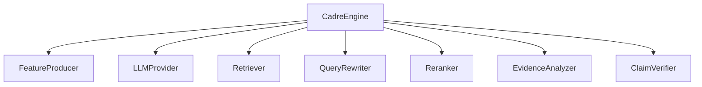

# Development

This document explains how to extend CADRE with custom components, custom feature producers, custom risk heads, and custom verification modules.

---

## Architecture Extension Points

CADRE is designed around core interface contracts in `cadre.interfaces`.



---

## 1. Implementing a Custom `FeatureProducer`

To use learned neural classifiers, embedding models, or custom heuristic extractors for risk heads, implement `FeatureProducer`:

```python
from typing import Mapping, Sequence, Any
from cadre import Document, Head, TrustedContext
from cadre.interfaces import FeatureProducer

class AdvancedFeatureProducer(FeatureProducer):
    def __init__(self, classifier_model: Any = None):
        self.model = classifier_model

    def produce(
        self,
        head: Head,
        context: TrustedContext,
        documents: Sequence[Document],
        response: str | None,
        *,
        metadata: Mapping[str, Any],
    ) -> Mapping[str, float | None]:
        if head is Head.INSTRUCTION:
            # Custom feature computation for instruction head
            return {
                "uncertainty": 0.1,
                "task_inconsistency": 0.05,
                "role_conflict": 0.0,
                "boundary_violation": 0.0,
                "script_anomaly": 0.02,
                "missing_indicator": 0.0,
            }
        
        # Fall back or compute features for other heads...
        return {name: 0.0 for name in ["missing_indicator"]}
```

---

## 2. Implementing a Custom `ClaimVerifier`

Integrate custom NLI (Natural Language Inference) models or semantic verifiers by implementing `ClaimVerifier`:

```python
from typing import Mapping, Sequence, Any
from cadre import Document, EvidenceState
from cadre.interfaces import ClaimVerifier

class NLIClaimVerifier(ClaimVerifier):
    def __init__(self, nli_pipeline: Any):
        self.nli = nli_pipeline

    def verify(
        self,
        response: str,
        documents: Sequence[Document],
        *,
        metadata: Mapping[str, Any],
    ) -> tuple[EvidenceState, dict[str, float]]:
        if not response or not documents:
            return EvidenceState.INSUFFICIENT, {"unsupported_insufficient": 1.0}

        # Run NLI model against combined document premise
        premise = " ".join(d.text for d in documents)
        # NLI prediction logic...
        
        state = EvidenceState.SUPPORTED
        features = {
            "unsupported_insufficient": 0.0,
            "unsupported_contradicted": 0.0,
            "unsupported_conflicting": 0.0,
            "dependency_unsupported": 0.0,
            "no_claim": 0.0,
            "segmentation_failure": 0.0,
            "verifier_failure": 0.0,
        }
        return state, features
```

---

## 3. Registering Custom Risk Model Bundles

Custom risk models can be trained and bundled into `RiskModelBundle` and passed directly into `CadreEngine`:

```python
from cadre import CadreEngine, CadreConfig, Head
from cadre.risk import MonotoneRiskHead, RiskModelBundle

config = CadreConfig.safe_default()

custom_risk_bundle = RiskModelBundle({
    head: MonotoneRiskHead(
        cfg.feature_names,
        threshold=cfg.threshold,
    )
    for head, cfg in config.heads.items()
})

engine = CadreEngine(
    config=config,
    llm=my_llm,
    retriever=my_retriever,
    risk_models=custom_risk_bundle,
    feature_producer=AdvancedFeatureProducer(),
    claim_verifier=NLIClaimVerifier(None),
)
```

---

## Development Best Practices

- **Immutability**: Maintain Pydantic models with `frozen=True` and `extra="forbid"` to prevent accidental mutation of context or config objects.
- **Fail-Closed**: Always ensure custom feature producers and adapters gracefully handle empty document sequences, `None` responses, or malformed text inputs.
- **Runtime Budgets**: Respect token and iteration limits specified in `RuntimeBudget`.
